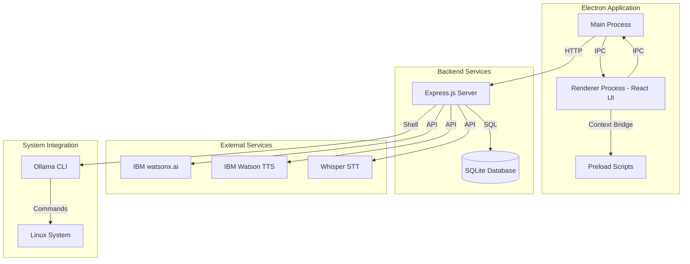
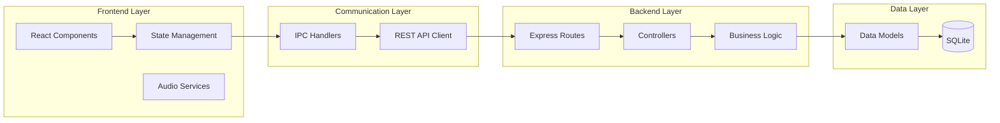
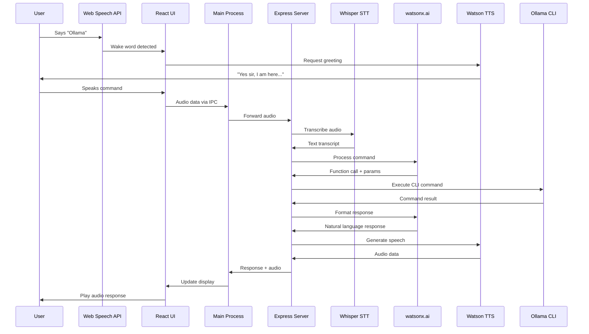
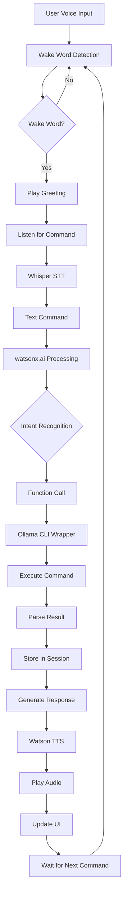
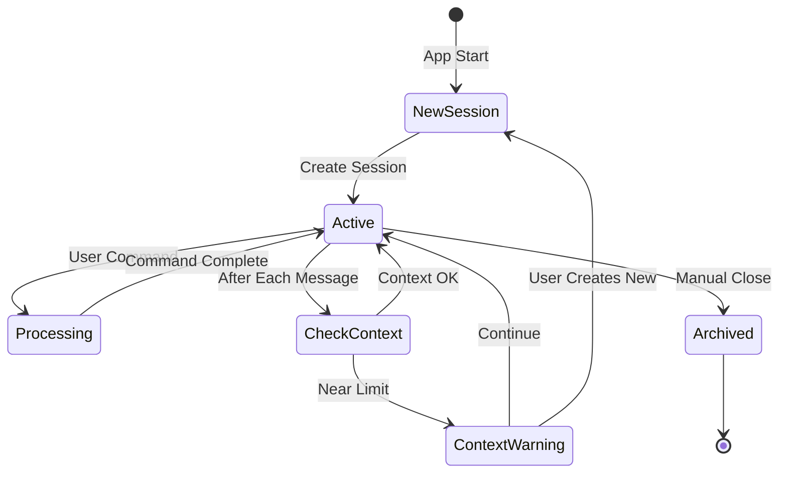
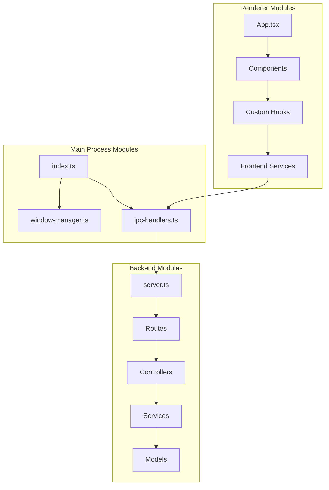
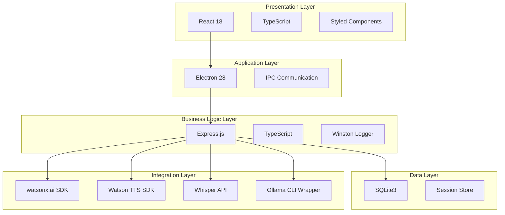
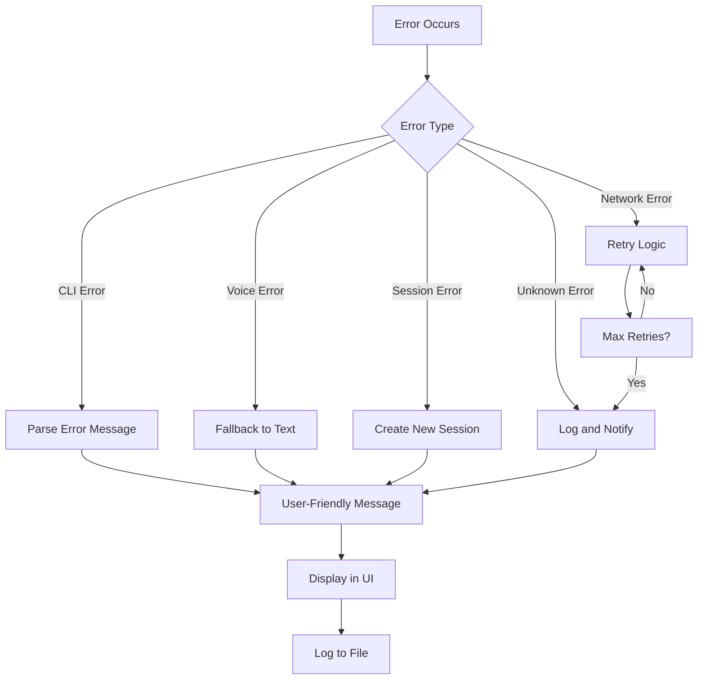
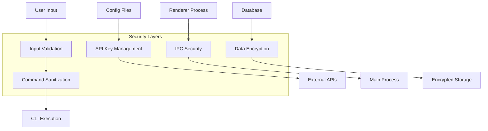
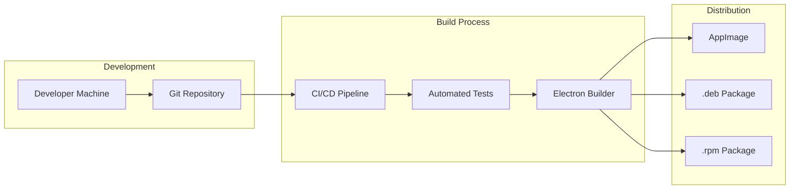

# Ollama Voice Orchestrator (OVO) - Architecture Documentation

## System Architecture Overview

This document provides detailed architectural diagrams and explanations for the OVO application.

---

## High-Level Architecture



---

## Component Architecture



---

## Voice Interaction Flow



---

## Data Flow Architecture



---

## Session Management Flow



---

## Module Dependencies



---

## Technology Stack Layers



---

## File System Structure

```
ollama-voice-orchestrator/
│
├── src/
│   ├── main/                    # Electron Main Process
│   │   ├── index.ts            # Entry point, app lifecycle
│   │   ├── window-manager.ts   # Window creation and management
│   │   └── ipc-handlers.ts     # IPC communication handlers
│   │
│   ├── renderer/                # React Frontend
│   │   ├── components/
│   │   │   ├── AudioVisualizer/
│   │   │   │   ├── AudioVisualizer.tsx
│   │   │   │   ├── AudioVisualizer.styles.ts
│   │   │   │   └── index.ts
│   │   │   ├── ChatPanel/
│   │   │   │   ├── ChatPanel.tsx
│   │   │   │   ├── Message.tsx
│   │   │   │   ├── ChatInput.tsx
│   │   │   │   └── index.ts
│   │   │   ├── SidePanel/
│   │   │   │   ├── SidePanel.tsx
│   │   │   │   ├── ModelList.tsx
│   │   │   │   └── index.ts
│   │   │   ├── Analytics/
│   │   │   │   ├── Analytics.tsx
│   │   │   │   ├── MetricCard.tsx
│   │   │   │   └── index.ts
│   │   │   └── VoiceIndicator/
│   │   │       ├── VoiceIndicator.tsx
│   │   │       └── index.ts
│   │   ├── hooks/
│   │   │   ├── useVoiceRecognition.ts
│   │   │   ├── useAudioVisualizer.ts
│   │   │   ├── useSession.ts
│   │   │   └── useOllama.ts
│   │   ├── services/
│   │   │   ├── ipc-service.ts
│   │   │   ├── audio-service.ts
│   │   │   └── api-client.ts
│   │   ├── store/
│   │   │   ├── index.ts
│   │   │   ├── session-store.ts
│   │   │   └── ui-store.ts
│   │   ├── App.tsx
│   │   └── index.tsx
│   │
│   ├── backend/                 # Express Backend
│   │   ├── controllers/
│   │   │   ├── ollama-controller.ts
│   │   │   ├── session-controller.ts
│   │   │   └── voice-controller.ts
│   │   ├── services/
│   │   │   ├── ollama-wrapper.ts
│   │   │   ├── watsonx-service.ts
│   │   │   ├── whisper-service.ts
│   │   │   ├── tts-service.ts
│   │   │   └── session-manager.ts
│   │   ├── models/
│   │   │   ├── session.model.ts
│   │   │   ├── message.model.ts
│   │   │   └── analytics.model.ts
│   │   ├── routes/
│   │   │   ├── ollama.routes.ts
│   │   │   ├── session.routes.ts
│   │   │   └── voice.routes.ts
│   │   ├── middleware/
│   │   │   ├── error-handler.ts
│   │   │   ├── logger.ts
│   │   │   └── validator.ts
│   │   ├── config/
│   │   │   ├── database.ts
│   │   │   ├── watson.ts
│   │   │   └── constants.ts
│   │   └── server.ts
│   │
│   ├── shared/
│   │   ├── types/
│   │   │   ├── ollama.types.ts
│   │   │   ├── session.types.ts
│   │   │   └── voice.types.ts
│   │   └── constants/
│   │       └── app-constants.ts
│   │
│   └── preload/
│       └── index.ts
│
├── scripts/
│   ├── list-models.sh
│   ├── show-model.sh
│   ├── run-model.sh
│   ├── stop-model.sh
│   ├── pull-model.sh
│   ├── remove-model.sh
│   └── get-running-models.sh
│
└── database/
    └── schema.sql
```

---

## API Endpoints Design

### Ollama Operations
```
GET    /api/ollama/models              # List all models
GET    /api/ollama/models/:name        # Get model details
POST   /api/ollama/models/run          # Run a model
POST   /api/ollama/models/stop         # Stop a model
POST   /api/ollama/models/pull         # Download a model
DELETE /api/ollama/models/:name        # Remove a model
GET    /api/ollama/running             # List running models
```

### Session Management
```
GET    /api/sessions                   # Get all sessions
GET    /api/sessions/:id               # Get session by ID
POST   /api/sessions                   # Create new session
PUT    /api/sessions/:id               # Update session
DELETE /api/sessions/:id               # Delete session
GET    /api/sessions/:id/messages      # Get session messages
POST   /api/sessions/:id/messages      # Add message to session
```

### Voice Operations
```
POST   /api/voice/transcribe           # Transcribe audio to text
POST   /api/voice/synthesize           # Convert text to speech
POST   /api/voice/process-command      # Process voice command
```

### Analytics
```
GET    /api/analytics/models           # Get model analytics
GET    /api/analytics/system           # Get system metrics
```

---

## IPC Communication Channels

### Main → Renderer
```typescript
// Window events
'window:ready'
'window:focus'
'window:blur'

// Ollama events
'ollama:model-list-updated'
'ollama:model-started'
'ollama:model-stopped'

// Session events
'session:created'
'session:updated'
'session:context-warning'

// Voice events
'voice:wake-word-detected'
'voice:transcription-complete'
'voice:response-ready'
```

### Renderer → Main
```typescript
// Ollama commands
'ollama:list-models'
'ollama:show-model'
'ollama:run-model'
'ollama:stop-model'
'ollama:pull-model'
'ollama:remove-model'

// Session commands
'session:create'
'session:get-current'
'session:add-message'

// Voice commands
'voice:start-listening'
'voice:stop-listening'
'voice:process-audio'
```

---

## State Management Structure

```typescript
// Global Application State
interface AppState {
  // UI State
  ui: {
    sidebarOpen: boolean;
    activeView: 'chat' | 'models' | 'settings';
    theme: 'light' | 'dark';
  };
  
  // Session State
  session: {
    currentSessionId: string | null;
    sessions: Session[];
    messages: Message[];
    contextLength: number;
    maxContextLength: number;
  };
  
  // Ollama State
  ollama: {
    models: OllamaModel[];
    runningModels: RunningModel[];
    currentModel: string | null;
  };
  
  // Voice State
  voice: {
    isListening: boolean;
    isProcessing: boolean;
    wakeWordDetected: boolean;
    lastTranscript: string | null;
  };
  
  // Analytics State
  analytics: {
    modelMetrics: ModelMetrics[];
    systemMetrics: SystemMetrics;
  };
}
```

---

## Error Handling Strategy



---

## Security Architecture



---

## Performance Optimization Strategy

### Frontend Optimizations
- React.memo for expensive components
- Virtual scrolling for chat history
- Web Workers for audio processing
- RequestAnimationFrame for visualizer
- Lazy loading for routes

### Backend Optimizations
- Connection pooling for database
- Caching for frequent queries
- Async/await for non-blocking operations
- Stream processing for large responses
- Rate limiting for API calls

### Memory Management
- Cleanup old sessions periodically
- Limit message history in memory
- Release audio buffers after use
- Garbage collection hints
- Monitor memory usage

---

## Deployment Architecture



---

## Monitoring and Logging

```typescript
// Logging Levels
enum LogLevel {
  ERROR = 'error',
  WARN = 'warn',
  INFO = 'info',
  DEBUG = 'debug',
  TRACE = 'trace'
}

// Log Structure
interface LogEntry {
  timestamp: string;
  level: LogLevel;
  module: string;
  message: string;
  metadata?: Record<string, any>;
  error?: Error;
}

// Monitoring Metrics
interface Metrics {
  // Performance
  responseTime: number;
  memoryUsage: number;
  cpuUsage: number;
  
  // Usage
  commandsExecuted: number;
  sessionsCreated: number;
  voiceInteractions: number;
  
  // Errors
  errorCount: number;
  errorRate: number;
}
```

---

*This architecture document will be updated as the project evolves.*