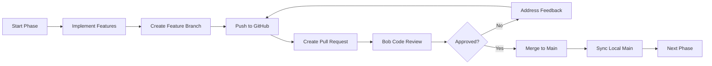

# Ollama Voice Orchestrator (OVO) - Development Guide

## 📚 Table of Contents

- [Getting Started](#getting-started)
- [Development Workflow](#development-workflow)
- [Phase-Based Development](#phase-based-development)
- [Code Review Process](#code-review-process)
- [Coding Standards](#coding-standards)
- [Git Workflow](#git-workflow)
- [Testing Guidelines](#testing-guidelines)
- [Documentation Standards](#documentation-standards)

---

## 🚀 Getting Started

### Initial Setup

1. **Clone the Repository**
```bash
git clone git@github.com:Men6d656e/ibm_hackaton_bob_ide.git
cd ibm_hackaton_bob_ide
```

2. **Install Dependencies**
```bash
npm install
```

3. **Set Up Environment Variables**
```bash
cp .env.example .env
# Edit .env with your API keys
```

4. **Initialize Database**
```bash
npm run db:init
```

5. **Start Development Server**
```bash
npm run dev
```

---

## 🔄 Development Workflow

### Phase-Based Approach

This project follows a **structured, phase-based development approach** with mandatory code reviews between phases. This ensures:

- ✅ High code quality
- ✅ Consistent architecture
- ✅ Early bug detection
- ✅ Knowledge sharing
- ✅ Professional standards

### Workflow Steps



---

## 📋 Phase-Based Development

### Phase 1: Project Setup and Documentation ✅

**Objective**: Establish project foundation and documentation

**Tasks**:
- [x] Create REQUIREMENTS.md with complete tech stack
- [x] Create ARCHITECTURE.md with system diagrams
- [x] Create README.md with setup instructions
- [ ] Set up Git repository
- [ ] Create initial commit
- [ ] Push to main branch

**Deliverables**:
- Complete project documentation
- Architecture diagrams
- Development guidelines

**Branch**: `phase-1-documentation`

---

### Phase 2: Backend Foundation

**Objective**: Set up backend infrastructure and Ollama integration

**Tasks**:
- [ ] Design backend API architecture
- [ ] Create project folder structure
- [ ] Initialize Electron + TypeScript
- [ ] Configure ESLint and Prettier
- [ ] Set up Express.js server
- [ ] Create Ollama CLI wrapper scripts
- [ ] Implement basic error handling

**Deliverables**:
- Working Express.js server
- Ollama CLI wrapper module
- TypeScript configuration
- Linting and formatting setup

**Branch**: `phase-2-backend-foundation`

**Key Files**:
```
src/backend/
├── server.ts
├── config/
├── services/
│   └── ollama-wrapper.ts
└── utils/
scripts/
├── list-models.sh
├── run-model.sh
└── stop-model.sh
```

---

### Phase 3: Database and Session Management

**Objective**: Implement data persistence and session handling

**Tasks**:
- [ ] Create SQLite database schema
- [ ] Implement session management service
- [ ] Create database models
- [ ] Build API endpoints for Ollama operations
- [ ] Add Winston logging system
- [ ] Implement request validation

**Deliverables**:
- SQLite database with schema
- Session management system
- Complete REST API endpoints
- Logging infrastructure

**Branch**: `phase-3-database-session`

**Key Files**:
```
database/
└── schema.sql
src/backend/
├── models/
│   ├── session.model.ts
│   └── message.model.ts
├── services/
│   └── session-manager.ts
└── routes/
    ├── ollama.routes.ts
    └── session.routes.ts
```

---

### Phase 4: AI Integration Layer

**Objective**: Integrate AI services for voice and command processing

**Tasks**:
- [ ] Integrate IBM watsonx.ai SDK
- [ ] Create function calling tool definitions
- [ ] Implement command parser
- [ ] Set up Whisper STT integration
- [ ] Integrate IBM Watson TTS
- [ ] Create voice response variation system

**Deliverables**:
- watsonx.ai integration
- Speech-to-text service
- Text-to-speech service
- Command processing pipeline

**Branch**: `phase-4-ai-integration`

**Key Files**:
```
src/backend/services/
├── watsonx-service.ts
├── whisper-service.ts
├── tts-service.ts
└── command-parser.ts
```

---

### Phase 5: Frontend Core

**Objective**: Build the React UI with core components

**Tasks**:
- [ ] Design UI mockups
- [ ] Set up React with TypeScript
- [ ] Implement VS Code-style layout
- [ ] Create chat interface component
- [ ] Build audio visualizer
- [ ] Create analytics dashboard
- [ ] Set up state management

**Deliverables**:
- Complete React UI
- Audio visualizer
- Chat interface
- Analytics dashboard

**Branch**: `phase-5-frontend-core`

**Key Files**:
```
src/renderer/
├── components/
│   ├── AudioVisualizer/
│   ├── ChatPanel/
│   ├── SidePanel/
│   └── Analytics/
├── hooks/
├── store/
└── App.tsx
```

---

### Phase 6: Voice Interaction System

**Objective**: Implement voice control and wake word detection

**Tasks**:
- [ ] Implement Web Speech API wake word
- [ ] Create microphone handling
- [ ] Build voice command pipeline
- [ ] Implement TTS response system
- [ ] Add voice feedback variations
- [ ] Create voice activity detection

**Deliverables**:
- Wake word detection
- Voice command processing
- Audio feedback system
- Microphone management

**Branch**: `phase-6-voice-system`

**Key Files**:
```
src/renderer/
├── services/
│   ├── audio-service.ts
│   └── voice-recognition.ts
└── hooks/
    └── useVoiceRecognition.ts
```

---

### Phase 7: Integration and Features

**Objective**: Connect all components and add features

**Tasks**:
- [ ] Connect frontend to backend API
- [ ] Implement real-time updates
- [ ] Add context length monitoring
- [ ] Create new session workflow
- [ ] Implement error handling
- [ ] Add loading states

**Deliverables**:
- Fully integrated application
- Real-time data updates
- Error handling system
- User notifications

**Branch**: `phase-7-integration`

---

### Phase 8: Testing and Polish

**Objective**: Ensure quality and polish the application

**Tasks**:
- [ ] Write unit tests
- [ ] Test Ollama operations
- [ ] Test voice interactions
- [ ] UI/UX refinements
- [ ] Add keyboard shortcuts
- [ ] Optimize performance

**Deliverables**:
- Test suite with 70%+ coverage
- Performance optimizations
- Polished UI/UX
- Keyboard shortcuts

**Branch**: `phase-8-testing-polish`

---

### Phase 9: Deployment and Documentation

**Objective**: Prepare for production deployment

**Tasks**:
- [ ] Create Linux build config
- [ ] Set up electron-builder
- [ ] Write user documentation
- [ ] Create developer docs
- [ ] Add JSDoc comments
- [ ] Create troubleshooting guide

**Deliverables**:
- Linux packages (AppImage, .deb, .rpm)
- Complete documentation
- Installation guides
- Release notes

**Branch**: `phase-9-deployment`

---

## 🔍 Code Review Process

### Using Bob's Review Feature

After completing each phase, use Bob's built-in code review capabilities:

1. **Create Pull Request**
```bash
# Push your feature branch
git push -u origin phase-X-feature-name

# Create PR on GitHub
```

2. **Request Bob Review**
```bash
# In Bob IDE, use the review command
/review https://github.com/Men6d656e/ibm_hackaton_bob_ide/pull/X
```

3. **Bob's Analysis**
Bob will analyze:
- Code quality and standards
- TypeScript type safety
- Potential bugs and issues
- Performance concerns
- Security vulnerabilities
- Documentation completeness
- Test coverage

4. **Address Feedback**
```bash
# Make necessary changes
git add .
git commit -m "fix: address code review feedback"
git push
```

5. **Approval and Merge**
```bash
# After approval, merge PR
git checkout main
git pull origin main
```

### Review Checklist

Before requesting review, ensure:

- [ ] All tests pass (`npm test`)
- [ ] No linting errors (`npm run lint`)
- [ ] Code is formatted (`npm run format`)
- [ ] TypeScript compiles (`npm run type-check`)
- [ ] JSDoc comments added
- [ ] README updated if needed
- [ ] No console.log statements
- [ ] Error handling implemented
- [ ] Performance considered

---

## 📝 Coding Standards

### TypeScript Guidelines

```typescript
/**
 * Example of proper JSDoc documentation
 * 
 * @description Fetches all installed Ollama models
 * @returns {Promise<OllamaModel[]>} Array of model objects
 * @throws {OllamaError} If Ollama CLI is not available
 * 
 * @example
 * const models = await listModels();
 * console.log(models);
 */
async function listModels(): Promise<OllamaModel[]> {
  try {
    // Implementation
  } catch (error) {
    throw new OllamaError('Failed to list models', error);
  }
}
```

### Naming Conventions

| Type | Convention | Example |
|------|-----------|---------|
| Files | kebab-case | `ollama-wrapper.ts` |
| Classes | PascalCase | `SessionManager` |
| Interfaces | PascalCase with I prefix | `ISession` |
| Functions | camelCase | `listModels()` |
| Constants | UPPER_SNAKE_CASE | `MAX_CONTEXT_LENGTH` |
| Components | PascalCase | `AudioVisualizer` |
| Hooks | camelCase with use prefix | `useVoiceRecognition` |

### File Structure

```typescript
// 1. Imports (grouped and sorted)
import { useState, useEffect } from 'react';
import type { OllamaModel } from '@/types';

// 2. Types and Interfaces
interface Props {
  model: OllamaModel;
}

// 3. Constants
const MAX_RETRIES = 3;

// 4. Component/Function
export function ModelCard({ model }: Props) {
  // Implementation
}

// 5. Exports
export default ModelCard;
```

### Error Handling

```typescript
// Custom error classes
class OllamaError extends Error {
  constructor(message: string, public cause?: Error) {
    super(message);
    this.name = 'OllamaError';
  }
}

// Proper error handling
try {
  const result = await riskyOperation();
  return result;
} catch (error) {
  logger.error('Operation failed', { error });
  throw new OllamaError('Failed to complete operation', error);
}
```

---

## 🌿 Git Workflow

### Branch Naming

```
phase-X-feature-name
├── phase-1-documentation
├── phase-2-backend-foundation
├── phase-3-database-session
└── ...
```

### Commit Messages

Follow [Conventional Commits](https://www.conventionalcommits.org/):

```
<type>(<scope>): <subject>

<body>

<footer>
```

**Types**:
- `feat`: New feature
- `fix`: Bug fix
- `docs`: Documentation
- `style`: Formatting
- `refactor`: Code restructuring
- `test`: Tests
- `chore`: Maintenance

**Examples**:
```bash
feat(backend): implement Ollama CLI wrapper with error handling

- Add listModels function
- Add runModel function
- Implement retry logic
- Add comprehensive error handling

Closes #123

fix(voice): resolve wake word detection latency

- Optimize audio buffer processing
- Reduce detection threshold
- Add debouncing logic

docs(readme): update installation instructions

- Add prerequisites section
- Update environment variables
- Add troubleshooting guide
```

### Git Commands Reference

```bash
# Start new phase
git checkout main
git pull origin main
git checkout -b phase-X-feature-name

# Regular commits
git add .
git commit -m "feat(scope): description"

# Push to remote
git push -u origin phase-X-feature-name

# Update from main
git checkout main
git pull origin main
git checkout phase-X-feature-name
git merge main

# After PR merge
git checkout main
git pull origin main
git branch -d phase-X-feature-name
```

---

## 🧪 Testing Guidelines

### Test Structure

```
tests/
├── unit/
│   ├── services/
│   │   ├── ollama-wrapper.test.ts
│   │   └── session-manager.test.ts
│   └── utils/
├── integration/
│   ├── api/
│   │   └── ollama-routes.test.ts
│   └── ipc/
└── e2e/
    └── voice-flow.test.ts
```

### Writing Tests

```typescript
import { describe, it, expect, beforeEach } from '@jest/globals';
import { OllamaWrapper } from '@/services/ollama-wrapper';

describe('OllamaWrapper', () => {
  let wrapper: OllamaWrapper;

  beforeEach(() => {
    wrapper = new OllamaWrapper();
  });

  describe('listModels', () => {
    it('should return array of models', async () => {
      const models = await wrapper.listModels();
      expect(Array.isArray(models)).toBe(true);
    });

    it('should throw error when Ollama is not available', async () => {
      // Mock Ollama unavailable
      await expect(wrapper.listModels()).rejects.toThrow();
    });
  });
});
```

### Test Commands

```bash
# Run all tests
npm test

# Run with coverage
npm run test:coverage

# Run specific test
npm test -- ollama-wrapper

# Watch mode
npm run test:watch

# Update snapshots
npm test -- -u
```

---

## 📖 Documentation Standards

### JSDoc Requirements

All public functions, classes, and modules must have JSDoc comments:

```typescript
/**
 * Manages Ollama model operations through CLI wrapper
 * 
 * @class OllamaWrapper
 * @description Provides a TypeScript interface to Ollama CLI commands
 * with error handling, retry logic, and type safety
 * 
 * @example
 * const ollama = new OllamaWrapper();
 * const models = await ollama.listModels();
 */
export class OllamaWrapper {
  /**
   * Lists all installed Ollama models
   * 
   * @returns {Promise<OllamaModel[]>} Array of model information
   * @throws {OllamaError} If CLI command fails
   * 
   * @example
   * const models = await ollama.listModels();
   * console.log(models.map(m => m.name));
   */
  async listModels(): Promise<OllamaModel[]> {
    // Implementation
  }
}
```

### README Updates

Update README.md when:
- Adding new features
- Changing installation steps
- Modifying configuration
- Adding dependencies
- Changing API

---

## 🎯 Best Practices

### Performance

- Use React.memo for expensive components
- Implement virtual scrolling for long lists
- Debounce user input
- Use Web Workers for heavy processing
- Optimize bundle size

### Security

- Validate all user inputs
- Sanitize CLI commands
- Store API keys in environment variables
- Use HTTPS for external APIs
- Implement rate limiting

### Accessibility

- Add ARIA labels
- Support keyboard navigation
- Provide text alternatives
- Ensure color contrast
- Test with screen readers

---

## 📞 Getting Help

- **Documentation**: Check [REQUIREMENTS.md](./REQUIREMENTS.md) and [ARCHITECTURE.md](./ARCHITECTURE.md)
- **Issues**: Create a GitHub issue
- **Discussions**: Use GitHub Discussions
- **Code Review**: Use Bob's `/review` command

---

*Last Updated: 2026-05-01*

---

## 🔧 Remaining Tasks

### Critical Security & Functionality Issues

#### High Priority

1. **Command Injection Vulnerability** (Security - High)
   - **Location**: `src/backend/services/ollama-wrapper.ts:137-158`
   - **Issue**: User input concatenated directly into shell commands without sanitization
   - **Action**: Implement input validation with whitelist (alphanumeric, hyphens, underscores only)
   - **Status**: ⚠️ Needs immediate attention

2. **Audio Stream Timeout Handling** (Functionality - High)
   - **Location**: `src/backend/services/tts-service.ts:290-306`
   - **Issue**: `streamToBuffer` lacks timeout, can hang indefinitely
   - **Action**: Add Promise.race with timeout mechanism
   - **Status**: ⚠️ Needs immediate attention

#### Medium Priority

3. **API Key Exposure in Logs** (Security - Medium)
   - **Location**: `src/backend/services/watsonx-service.ts:288-290`
   - **Issue**: Error messages may expose API keys in logs
   - **Action**: Sanitize error messages, use generic messages for config errors
   - **Status**: 🔶 Should be addressed

4. **Sensitive Data Logging** (Security - Medium)
   - **Location**: `src/backend/services/command-parser.ts:238`
   - **Issue**: Full command text logged, may contain sensitive user data
   - **Action**: Implement log sanitization, log only intent/function names in production
   - **Status**: 🔶 Should be addressed

5. **Audio Buffer Size Validation** (Functionality - Medium)
   - **Location**: `src/backend/services/whisper-service.ts:132-176`
   - **Issue**: No validation for buffer size before processing
   - **Action**: Add size validation against MAX_FILE_SIZE environment variable
   - **Status**: 🔶 Should be addressed

6. **Response Parsing Null Checks** (Functionality - Medium)
   - **Location**: `src/backend/services/watsonx-service.ts:301-322`
   - **Issue**: Nested property access without null checks
   - **Action**: Add optional chaining and fallback values
   - **Status**: 🔶 Should be addressed

7. **Singleton Race Conditions** (Functionality - Medium)
   - **Location**: `src/backend/services/watsonx-service.ts:414-427`
   - **Issue**: Singleton pattern without synchronization
   - **Action**: Use more robust singleton pattern or dependency injection
   - **Status**: 🔶 Should be addressed

8. **Generic Error Handling** (Functionality - Medium)
   - **Location**: `src/backend/routes/voice.routes.ts:63-72`
   - **Issue**: Error context lost in generic responses
   - **Action**: Preserve error types, provide specific error codes
   - **Status**: 🔶 Should be addressed

9. **Temp File Memory Leak** (Performance - Medium)
   - **Location**: `src/backend/services/whisper-service.ts:213-240`
   - **Issue**: Temp files may accumulate if process crashes
   - **Action**: Implement startup cleanup routine for old temp files
   - **Status**: 🔶 Should be addressed

#### Low Priority

10. **Base64 Encoding Overhead** (Performance - Low)
    - **Location**: `src/backend/routes/voice.routes.ts:36`
    - **Issue**: Double base64 conversion inefficient for large files
    - **Action**: Consider multipart/form-data or streaming
    - **Status**: 🔵 Nice to have

11. **Magic Numbers in Configuration** (Maintainability - Low)
    - **Location**: `src/backend/services/ollama-wrapper.ts:118-126`
    - **Issue**: Hardcoded retry values (3 retries, 1000ms delay)
    - **Action**: Extract to constants or environment variables
    - **Status**: 🔵 Nice to have

12. **Hardcoded Model ID** (Maintainability - Low)
    - **Location**: `src/backend/services/watsonx-service.ts:267`
    - **Issue**: Model ID 'meta-llama/llama-3-70b-instruct' hardcoded
    - **Action**: Extract to constant or environment variable
    - **Status**: 🔵 Nice to have

13. **Duplicate Error Handling** (Maintainability - Low)
    - **Location**: `src/backend/routes/voice.routes.ts:21-328`
    - **Issue**: Repeated try-catch pattern across routes
    - **Action**: Create error handling middleware
    - **Status**: 🔵 Nice to have

14. **Empty Text Validation** (Functionality - Low)
    - **Location**: `src/backend/routes/voice.routes.ts:79-91`
    - **Issue**: No validation for empty/whitespace-only text
    - **Action**: Add trim() validation, reject empty requests
    - **Status**: 🔵 Nice to have

### Task Priority Legend

- ⚠️ **High Priority**: Security vulnerabilities or critical functionality issues
- 🔶 **Medium Priority**: Important improvements for stability and security
- 🔵 **Low Priority**: Code quality and maintainability improvements

### Recommended Action Plan

1. **Sprint 1** (Week 1): Address all High Priority issues (#1-2)
2. **Sprint 2** (Week 2): Address Medium Priority security issues (#3-4)
3. **Sprint 3** (Week 3): Address remaining Medium Priority issues (#5-9)
4. **Sprint 4** (Week 4): Address Low Priority improvements (#10-14)

---