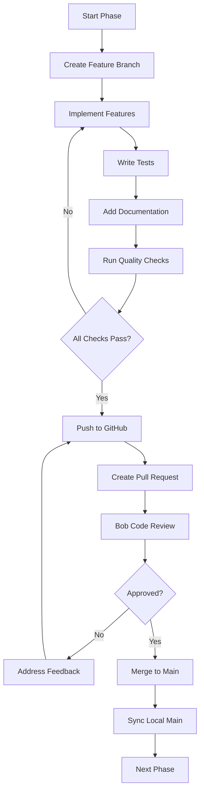

# 🎯 Ollama Voice Orchestrator (OVO) - Project Plan Summary

## Project Overview

**Project Name**: Ollama Voice Orchestrator (OVO)  
**Repository**: https://github.com/Men6d656e/ibm_hackaton_bob_ide  
**Purpose**: Voice-controlled desktop application for managing Ollama models on Linux  
**Development Approach**: Phase-based with mandatory code reviews

---

## 📊 Project Status

### Current Phase: Phase 1 - Documentation ✅

**Completed**:
- ✅ [`REQUIREMENTS.md`](./REQUIREMENTS.md) - Complete technical requirements and specifications
- ✅ [`ARCHITECTURE.md`](./ARCHITECTURE.md) - System architecture with Mermaid diagrams
- ✅ [`README.md`](./README.md) - Project overview and setup instructions
- ✅ [`DEVELOPMENT_GUIDE.md`](./DEVELOPMENT_GUIDE.md) - Comprehensive development workflow
- ✅ Project plan and todo list

**Next Steps**:
1. Set up Git repository and connect to GitHub remote
2. Create initial commit with documentation
3. Push to main branch
4. Create PR for Phase 1 review
5. Use Bob's `/review` command for code analysis
6. Merge after approval

---

## 🏗️ Tech Stack Summary

### Frontend Stack
```
Electron 28+ (Desktop Framework)
├── React 18+ (UI Library)
├── TypeScript 5+ (Type Safety)
├── Styled Components (Styling)
├── Zustand (State Management)
└── Web Audio API (Visualization)
```

### Backend Stack
```
Node.js 20+ (Runtime)
├── Express.js 4+ (API Server)
├── TypeScript 5+ (Type Safety)
├── SQLite3 (Database)
└── Winston (Logging)
```

### AI & Voice Services
```
IBM watsonx.ai (Function Calling)
├── OpenAI Whisper (Speech-to-Text)
├── IBM Watson TTS (Text-to-Speech)
└── Web Speech API (Wake Word Detection)
```

---

## 📅 Development Timeline

### Phase 1: Documentation ✅ (Completed)
- **Duration**: 1 day
- **Status**: Complete
- **Deliverables**: All documentation files created

### Phase 2: Backend Foundation (Next)
- **Duration**: 1 week
- **Focus**: Express server, Ollama CLI wrapper, TypeScript setup
- **Key Deliverables**:
  - Working Express.js server
  - Ollama CLI wrapper with all commands
  - Professional code structure

### Phase 3: Database & Sessions
- **Duration**: 1 week
- **Focus**: SQLite, session management, API endpoints
- **Key Deliverables**:
  - Database schema and models
  - Session management system
  - Complete REST API

### Phase 4: AI Integration
- **Duration**: 1 week
- **Focus**: watsonx.ai, Whisper, Watson TTS
- **Key Deliverables**:
  - AI service integrations
  - Command processing pipeline
  - Voice response system

### Phase 5: Frontend Core
- **Duration**: 1 week
- **Focus**: React UI, components, visualizer
- **Key Deliverables**:
  - Complete UI layout
  - Audio visualizer
  - Chat interface

### Phase 6: Voice System
- **Duration**: 1 week
- **Focus**: Wake word, voice commands, audio handling
- **Key Deliverables**:
  - Wake word detection
  - Voice command pipeline
  - Audio feedback system

### Phase 7: Integration
- **Duration**: 1 week
- **Focus**: Connect all components, real-time updates
- **Key Deliverables**:
  - Fully integrated application
  - Error handling
  - User notifications

### Phase 8: Testing & Polish
- **Duration**: 1 week
- **Focus**: Tests, optimization, refinements
- **Key Deliverables**:
  - Test suite (70%+ coverage)
  - Performance optimizations
  - UI/UX polish

### Phase 9: Deployment
- **Duration**: 3-4 days
- **Focus**: Build configuration, documentation
- **Key Deliverables**:
  - Linux packages
  - User documentation
  - Release notes

**Total Estimated Duration**: 8-9 weeks

---

## 🔄 Development Workflow

### Standard Phase Workflow



### Quality Checks Before PR

```bash
# Run all quality checks
npm run lint          # ESLint check
npm run format        # Prettier format
npm run type-check    # TypeScript compilation
npm test              # Run test suite
npm run build         # Build check
```

---

## 📋 Phase Breakdown

### Phase 1: Documentation ✅
```
[x] REQUIREMENTS.md
[x] ARCHITECTURE.md  
[x] README.md
[x] DEVELOPMENT_GUIDE.md
[ ] Git setup and initial commit
```

### Phase 2: Backend Foundation
```
[ ] Project structure
[ ] Electron + TypeScript setup
[ ] ESLint + Prettier config
[ ] Express.js server
[ ] Ollama CLI wrapper
[ ] Error handling
```

### Phase 3: Database & Sessions
```
[ ] SQLite schema
[ ] Database models
[ ] Session manager
[ ] API endpoints
[ ] Winston logging
[ ] Request validation
```

### Phase 4: AI Integration
```
[ ] watsonx.ai SDK
[ ] Tool definitions
[ ] Command parser
[ ] Whisper STT
[ ] Watson TTS
[ ] Response variations
```

### Phase 5: Frontend Core
```
[ ] React setup
[ ] Component structure
[ ] Side panel layout
[ ] Chat interface
[ ] Audio visualizer
[ ] Analytics dashboard
```

### Phase 6: Voice System
```
[ ] Wake word detection
[ ] Microphone handling
[ ] Voice command pipeline
[ ] TTS responses
[ ] Voice feedback
[ ] Activity detection
```

### Phase 7: Integration
```
[ ] Frontend-Backend connection
[ ] Real-time updates
[ ] Context monitoring
[ ] Session workflow
[ ] Error handling
[ ] Loading states
```

### Phase 8: Testing & Polish
```
[ ] Unit tests
[ ] Integration tests
[ ] E2E tests
[ ] UI/UX refinements
[ ] Keyboard shortcuts
[ ] Performance optimization
```

### Phase 9: Deployment
```
[ ] Build configuration
[ ] electron-builder setup
[ ] Linux packages
[ ] User documentation
[ ] Developer docs
[ ] Release preparation
```

---

## 🎯 Key Features

### Voice Control
- ✅ Wake word: "Ollama"
- ✅ Natural language commands
- ✅ Varied voice responses
- ✅ 5-15 second response time

### Model Management
- ✅ List models
- ✅ Show model info
- ✅ Run/stop models
- ✅ Download models
- ✅ Remove models

### User Interface
- ✅ VS Code-style layout
- ✅ Chat panel
- ✅ Audio visualizer
- ✅ Analytics dashboard
- ✅ Real-time metrics

### Session Management
- ✅ Multi-session support
- ✅ Context length tracking
- ✅ Session persistence
- ✅ Conversation history

---

## 📁 Project Structure

```
ollama-voice-orchestrator/
├── docs/
│   ├── REQUIREMENTS.md          ✅
│   ├── ARCHITECTURE.md          ✅
│   ├── README.md                ✅
│   ├── DEVELOPMENT_GUIDE.md     ✅
│   └── PROJECT_PLAN_SUMMARY.md  ✅
├── src/
│   ├── main/              # Electron main process
│   ├── renderer/          # React frontend
│   ├── backend/           # Express backend
│   ├── shared/            # Shared code
│   └── preload/           # Preload scripts
├── scripts/               # Ollama CLI wrappers
├── database/              # SQLite schemas
├── tests/                 # Test files
├── assets/                # Static assets
├── .env.example           # Environment template
├── .gitignore            # Git ignore rules
├── package.json          # Dependencies
├── tsconfig.json         # TypeScript config
└── electron-builder.json # Build config
```

---

## 🔐 Environment Variables

```env
# IBM Watson Configuration
WATSONX_API_KEY=your_watsonx_api_key
WATSONX_PROJECT_ID=your_project_id
WATSON_TTS_API_KEY=your_tts_api_key
WATSON_TTS_URL=your_tts_url

# Whisper Configuration
WHISPER_API_KEY=your_openai_api_key
WHISPER_MODEL_PATH=/path/to/whisper/model

# Application Configuration
PORT=3000
NODE_ENV=development
LOG_LEVEL=info
MAX_CONTEXT_LENGTH=4096
```

---

## 🚀 Getting Started

### For Development

```bash
# Clone repository
git clone git@github.com:Men6d656e/ibm_hackaton_bob_ide.git
cd ibm_hackaton_bob_ide

# Install dependencies
npm install

# Set up environment
cp .env.example .env
# Edit .env with your API keys

# Initialize database
npm run db:init

# Start development
npm run dev
```

### For Code Review

```bash
# After completing a phase
git push -u origin phase-X-feature-name

# Create PR on GitHub
# Then use Bob's review feature
/review https://github.com/Men6d656e/ibm_hackaton_bob_ide/pull/X
```

---

## 📊 Success Metrics

### Code Quality
- ✅ TypeScript strict mode
- ✅ Zero ESLint errors
- ✅ 70%+ test coverage
- ✅ All PRs reviewed by Bob
- ✅ JSDoc for all public APIs

### Performance
- ✅ Wake word detection < 500ms
- ✅ Voice transcription < 2s
- ✅ Command execution 5-15s
- ✅ UI updates < 100ms
- ✅ 60 FPS audio visualizer

### User Experience
- ✅ Intuitive voice commands
- ✅ Clear visual feedback
- ✅ Responsive UI
- ✅ Helpful error messages
- ✅ Professional appearance

---

## 🤝 Collaboration Workflow

### Branch Strategy
```
main (protected)
├── phase-1-documentation
├── phase-2-backend-foundation
├── phase-3-database-session
├── phase-4-ai-integration
├── phase-5-frontend-core
├── phase-6-voice-system
├── phase-7-integration
├── phase-8-testing-polish
└── phase-9-deployment
```

### PR Review Process
1. Developer completes phase
2. Creates PR with detailed description
3. Runs quality checks locally
4. Requests Bob review using `/review`
5. Bob analyzes code and provides feedback
6. Developer addresses feedback
7. PR approved and merged
8. Team syncs with main branch

---

## 📚 Documentation Index

| Document | Purpose | Status |
|----------|---------|--------|
| [`REQUIREMENTS.md`](./REQUIREMENTS.md) | Technical specifications | ✅ Complete |
| [`ARCHITECTURE.md`](./ARCHITECTURE.md) | System design & diagrams | ✅ Complete |
| [`README.md`](./README.md) | Project overview | ✅ Complete |
| [`DEVELOPMENT_GUIDE.md`](./DEVELOPMENT_GUIDE.md) | Development workflow | ✅ Complete |
| [`PROJECT_PLAN_SUMMARY.md`](./PROJECT_PLAN_SUMMARY.md) | This document | ✅ Complete |

---

## 🎓 Learning Resources

### Electron
- [Electron Documentation](https://www.electronjs.org/docs)
- [Electron TypeScript Boilerplate](https://github.com/electron-react-boilerplate/electron-react-boilerplate)

### IBM Watson
- [watsonx.ai Documentation](https://www.ibm.com/docs/en/watsonx-as-a-service)
- [Watson TTS API](https://cloud.ibm.com/apidocs/text-to-speech)

### Voice Technologies
- [Web Speech API](https://developer.mozilla.org/en-US/docs/Web/API/Web_Speech_API)
- [OpenAI Whisper](https://github.com/openai/whisper)

---

## 🎯 Next Actions

### Immediate (Phase 1 Completion)
1. ✅ Review all documentation
2. ⏳ Set up Git repository
3. ⏳ Create initial commit
4. ⏳ Push to main branch
5. ⏳ Create Phase 1 PR
6. ⏳ Bob code review
7. ⏳ Merge and proceed to Phase 2

### Short Term (Phase 2)
1. Design backend API architecture
2. Set up project structure
3. Initialize Electron + TypeScript
4. Configure development tools
5. Implement Express server
6. Create Ollama CLI wrapper

### Medium Term (Phases 3-6)
- Complete backend infrastructure
- Integrate AI services
- Build frontend UI
- Implement voice system

### Long Term (Phases 7-9)
- Full integration
- Comprehensive testing
- Production deployment

---

## 📞 Support & Resources

- **Repository**: https://github.com/Men6d656e/ibm_hackaton_bob_ide
- **Issues**: [GitHub Issues](https://github.com/Men6d656e/ibm_hackaton_bob_ide/issues)
- **Discussions**: [GitHub Discussions](https://github.com/Men6d656e/ibm_hackaton_bob_ide/discussions)
- **Code Review**: Use Bob's `/review` command

---

## ✅ Phase 1 Checklist

Before moving to Phase 2, ensure:

- [x] REQUIREMENTS.md created with complete specifications
- [x] ARCHITECTURE.md created with system diagrams
- [x] README.md created with setup instructions
- [x] DEVELOPMENT_GUIDE.md created with workflow details
- [x] PROJECT_PLAN_SUMMARY.md created
- [ ] Git repository initialized
- [ ] Initial commit created
- [ ] Pushed to main branch
- [ ] Phase 1 PR created
- [ ] Bob review completed
- [ ] PR merged to main

---

<div align="center">

**🎉 Phase 1 Documentation Complete!**

Ready to proceed with implementation phases.

*Last Updated: 2026-05-01*

</div>